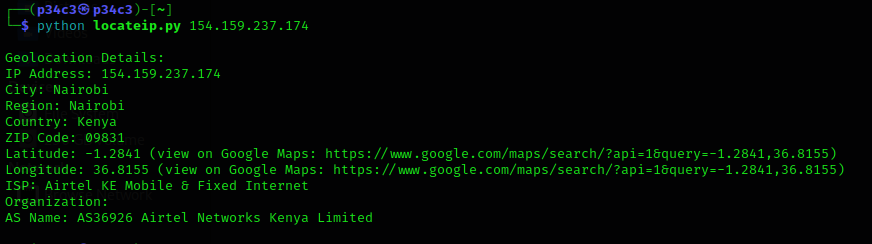

# IP Geolocation Tool

This Python script allows you to geolocate an IP address using the IP-API service. It retrieves information such as the city, region, country, ZIP code, latitude, longitude, ISP, organization, and AS name associated with the provided IP address.


# Disclaimer

This project is created and provided for educational purposes only. The code and information provided are intended to demonstrate programming concepts and should not be used for any malicious or illegal activities. I assume no responsibility for any misuse or damage caused by the use of this project.

## Prerequisites

Make sure you have the following dependencies installed:

- Python 3.x
- requests library

## Usage

1. Clone the repository:

   ```git clone https://github.com/cy-cus/IP-Geolocator.git```


2. Navigate to the project directory:

   ```cd IP-Geolocator```


3. Run the script and provide the IP address as an argument:

   ```python locateip.py <IP_ADDRESS>```


Replace `<IP_ADDRESS>` with the IP address you want to geolocate.

## Using Docker

1. Navigate to the project directory:

	```cd IP-Geolocator```

2. Build the docker image

	```docker build -t locateip .```

3. Run the docker container with the ip address you want to locate

    ```docker run locateip <ip_address>```


## Output

The script will fetch the geolocation details for the provided IP address and display them in the console. The information includes:

- IP Address
- City
- Region
- Country
- ZIP Code
- Latitude (with a link to view on Google Maps)
- Longitude (with a link to view on Google Maps)
- ISP
- Organization
- AS Name

If the geolocation data cannot be retrieved or there's an error, an appropriate error message will be displayed.

## License

This project is licensed under the [MIT License](LICENSE).

